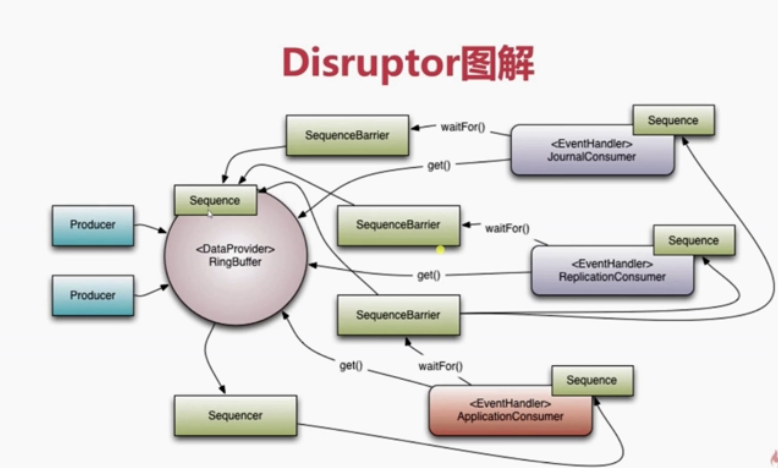

Deep-in-Disruptor-Step-By-Step

# 1. 概览





# 2. Disruptor Quick Start

## 2.1 建立Event类


**建立一个工厂Event类，用于创建Eveent类实例对象**

```
package com.wisdom.disruptor.quickstart;

public class OrderEvent {

    public long getValue() {
        return value;
    }

    public void setValue(long value) {
        this.value = value;
    }

    private long value;

}
```


##2.2  创建事件监听类

**需要一个事件监听类，用于处理数据(Event类)**

```
package com.wisdom.disruptor.quickstart;
import com.lmax.disruptor.EventHandler;

/**
 *  具体消费者，
 */
public class OrderEventHandler implements  EventHandler<OrderEvent> {
    /**
     *事件驱动时间，
     */
    @Override
    public void onEvent(OrderEvent orderEvent, long l, boolean b) throws Exception {
        System.out.println("OrderEventHandler.onEvent value =="+orderEvent.getValue());
    }
}
```


## 2.3  实例化Disruptror实例

**实例化Disruptror实例，配置一系列参数，编写Disruptor核心组件**


## 2.4 编写生产者组件


# 3. Disruptor 核心原理

1. RingBuffer是核心；
2. 生产者向RingBuffer中写数据；
3. 消费者从RingBuffer中取数据；

## 3.1 RingBuffer


-  首尾相接的环

  

- 上下文线程中传递数据的Buffer;

  

- RingBuffer并且拥有一个序号，序号执行数组中的下一个可用元素；

  

  

  随着你不停地填充这个buffer（可能也会有相应的读取），这个序号会一直增长，直到绕过这个环。

要找到数组中当前序号指向的元素，可以通过mod操作：

> ​        sequence mod array length = array index

以上面的ringbuffer为例（java的mod语法）：12 % 10 = 2。很简单吧。

事实上，上图中的ringbuffer只有10个槽完全是个意外。如果槽的个数是2的N次方更有利于基于二进制的计算机进行计算


##3.2 Sequence


1. 通过顺序递增的序号来编号，管理进行交换的数据；

2. 对数据（事件）的处理过程总数沿着序号逐个递增处理

3. 一个Sequence 用于跟踪标识某个特定的事件处理者（RingBuffer/Producer/Consumer）的处理进度；

4. 可以看成是一个AtomicLong用于标识进度；

5. 另外的目的防止不同Sequence 之间不同CPU缓存伪共享（Flase Sharing）的问题；

## 3.3 Sequencer 


    1.是Disruptor的真正核心 
    
    2.两个实现类

   ```
SingleProducerSequencer
MultiProducerSequencer
   ```

   3.主要实现生产者和消费者之间快速，正确地传递数据的并发算法；

   

   

   

## 3.4  Sequence Barrier

   1. 用于保持对RingBuffer的 Main Published Sequence (Producer) 和Consumer之间的平衡关系；
2. Sequence Barrier 定义了决定Consumer是否还有可处理的事件的逻辑；
  

  
   


## 3.5 WaitStrategy

1.  决定一个消费者将如何等待生产者将Event置入Disruptor

2. 主要策略

   - BlockingWaitStrategy

     - ​	最低效

     - ​	CPU消耗最新

     - ​	 各种不同环境中能提供更加一致性的表现

     - ​	 block 暗示使用到锁；

       

   - SleepingWaitStrategy

     - ​    表现和BlockingWaitStrategy相当；

     - ​	CUP消耗与BlockingWaitStrategy持平

     - ​	对生产者线程影响最小，适合用户异步日志类似的场景

       

   - YieldingWaitStrategy

     - 性能最优

     - 适合用于低延迟系统；
   
     - 要求极高性能且事件处理线数小于CPU逻辑核心数场景中，推荐使用此策略；例如，CPU开启超线程特性；
   
       

## 3.6 Event

1. Event: 从生产者到消费者过程中所处理的数据单元；
2. Disruptor 中没有代码表示Event，因为它完全是由用户定义的；


## 3.7 EventProcessor

1. EventProcessor: 主要事件循环，处理Disruptor中的Event，拥有消费者的Sequence;
2.  实现类BatchEventProcessor,包含了event loop 有效的实现，并且将回调到一个EventHandler接口的实现对象


## 3.8 WorkProcessor


​										

## 3.9EventHandler

1. EventHandler: 由用户实现并且代表了Disruptor中的一个消费者的接口， 消费者逻辑处理的地方；

   


##3.10 核心概念真题图解


